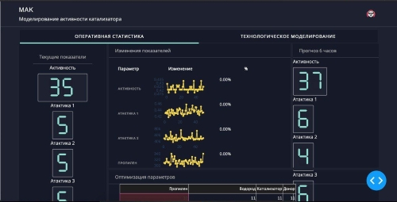
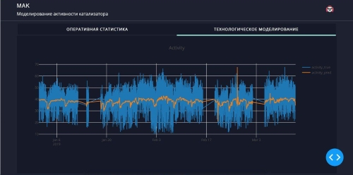

# catalyst_app
`catalyst_app` is a web application for monitoring and prediction of chemical catalyst process of polypropylene.
Data consist from timeseries of real process with 1 minute interval.
A pretrained backend model predicts future parameters (`activity`, `atactic`)
 for 6 hour forward based of current state parameters.

Screenshots

